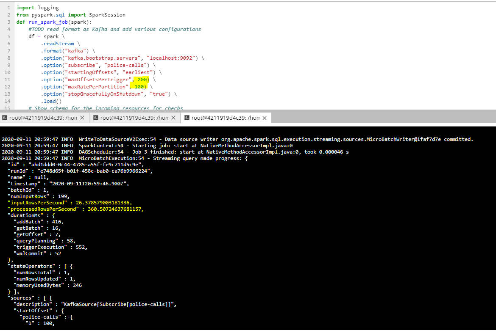
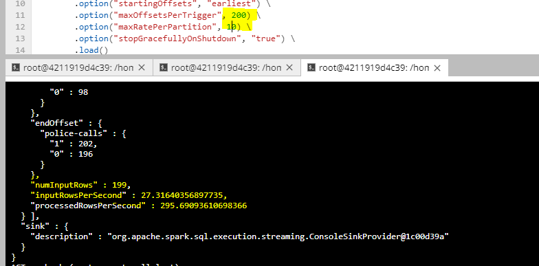
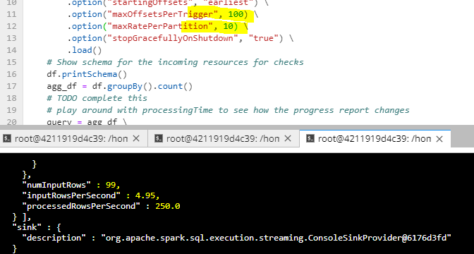
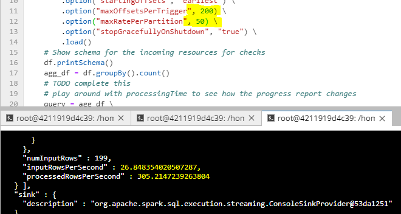
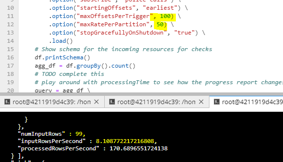

# SF Crime Project

## Question 1

How did changing values on the SparkSession property parameters affect the throughput and latency of the data?

We change values on two SparkSession property parametters : 
 * "maxOffsetsPerTrigger"
 * "maxRatePerPartition". 
 
So, it either increased or decreased number of records processed in a trigger (numInputRecords), 
rate of data arriving (inputRowsPerSecond) and rate at which Spark is processing data (processedRowsPerSecond)

## Question 2
What were the 2-3 most efficient SparkSession property key/value pairs? Through testing multiple variations on values, how can you tell these were the most optimal?

Based on the answer from Question 1, we think that some most efficeient SparkSession property key/value pairs are maxOffsetsPerTrigger , maxRatePerPartition, and others for setting memory (spark.executor.memory, spark.executor.cores) or parallelism 

Testing multiple variations on values **maxOffsetPerTrigger** and **maxRatePerPartition**, we can suggest the most optimal values in our actual configuration Spark Streaming environment (for example to optimize processRowsPerSecond at 360 rps, we can change these two parameters at 200, 100)

